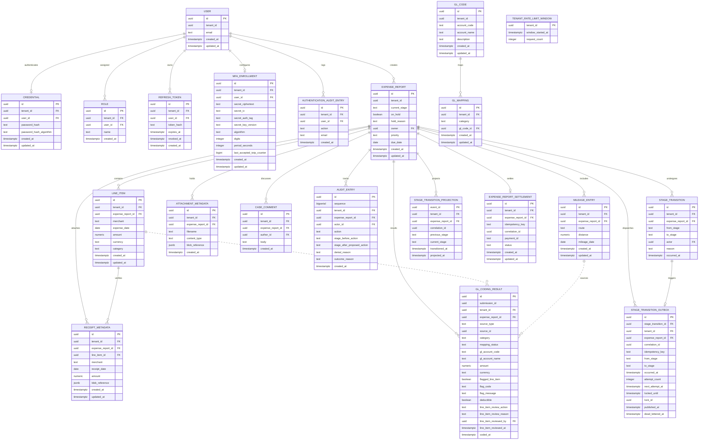

```mermaid
erDiagram
    USER {
        uuid id PK
        uuid tenant_id
        text email
        timestamptz created_at
        timestamptz updated_at
    }

    CREDENTIAL {
        uuid id PK
        uuid tenant_id FK
        uuid user_id FK
        text password_hash
        text password_hash_algorithm
        timestamptz created_at
        timestamptz updated_at
    }

    ROLE {
        uuid id PK
        uuid tenant_id FK
        uuid user_id FK
        text name
        timestamptz created_at
    }

    REFRESH_TOKEN {
        uuid id PK
        uuid tenant_id FK
        uuid user_id FK
        text token_hash
        timestamptz expires_at
        timestamptz revoked_at
        timestamptz created_at
    }

    MFA_ENROLLMENT {
        uuid id PK
        uuid tenant_id FK
        uuid user_id FK
        text secret_ciphertext
        text secret_iv
        text secret_auth_tag
        text secret_key_version
        text algorithm
        integer digits
        integer period_seconds
        bigint last_accepted_totp_counter
        timestamptz created_at
        timestamptz updated_at
    }

    AUTHENTICATION_AUDIT_ENTRY {
        uuid id PK
        uuid tenant_id FK
        uuid user_id FK
        text action
        text email
        timestamptz created_at
    }

    EXPENSE_REPORT {
        uuid id PK
        uuid tenant_id
        text current_stage
        boolean on_hold
        text hold_reason
        uuid owner FK
        text priority
        date due_date
        timestamptz created_at
        timestamptz updated_at
    }

    LINE_ITEM {
        uuid id PK
        uuid tenant_id FK
        uuid expense_report_id FK
        text merchant
        date expense_date
        numeric amount
        text currency
        text category
        timestamptz created_at
        timestamptz updated_at
    }

    MILEAGE_ENTRY {
        uuid id PK
        uuid tenant_id FK
        uuid expense_report_id FK
        text route
        numeric distance
        date mileage_date
        timestamptz created_at
        timestamptz updated_at
    }

    RECEIPT_METADATA {
        uuid id PK
        uuid tenant_id FK
        uuid expense_report_id FK
        uuid line_item_id FK
        text merchant
        date receipt_date
        numeric amount
        jsonb blob_reference
        timestamptz created_at
        timestamptz updated_at
    }

    ATTACHMENT_METADATA {
        uuid id PK
        uuid tenant_id FK
        uuid expense_report_id FK
        text filename
        text content_type
        jsonb blob_reference
        timestamptz created_at
    }

    CASE_COMMENT {
        uuid id PK
        uuid tenant_id FK
        uuid expense_report_id FK
        uuid author_id FK
        text body
        timestamptz created_at
    }

    AUDIT_ENTRY {
        uuid id PK
        bigserial sequence
        uuid tenant_id FK
        uuid expense_report_id FK
        uuid actor_id FK
        text action
        text stage_before_action
        text stage_after_proposed_action
        text denial_reason
        text outcome_reason
        timestamptz created_at
    }

    STAGE_TRANSITION {
        uuid id PK
        uuid tenant_id FK
        uuid expense_report_id FK
        text from_stage
        text to_stage
        uuid actor FK
        text reason
        timestamptz occurred_at
    }

    STAGE_TRANSITION_OUTBOX {
        uuid id PK
        uuid stage_transition_id FK
        uuid tenant_id FK
        uuid expense_report_id FK
        uuid correlation_id
        text idempotency_key
        text from_stage
        text to_stage
        timestamptz occurred_at
        integer attempt_count
        timestamptz next_attempt_at
        timestamptz locked_until
        uuid lock_id
        timestamptz published_at
        timestamptz dead_lettered_at
    }

    STAGE_TRANSITION_PROJECTION {
        uuid event_id PK
        uuid tenant_id FK
        uuid expense_report_id FK
        uuid correlation_id
        text previous_stage
        text current_stage
        timestamptz transitioned_at
        timestamptz projected_at
    }

    EXPENSE_REPORT_SETTLEMENT {
        uuid id PK
        uuid tenant_id FK
        uuid expense_report_id FK
        text idempotency_key
        uuid correlation_id
        text payment_id
        text status
        timestamptz created_at
        timestamptz updated_at
    }

    GL_CODE {
        uuid id PK
        uuid tenant_id
        text account_code
        text account_name
        text description
        timestamptz created_at
        timestamptz updated_at
    }

    GL_MAPPING {
        uuid id PK
        uuid tenant_id FK
        text category
        uuid gl_code_id FK
        timestamptz created_at
        timestamptz updated_at
    }

    GL_CODING_RESULT {
        uuid id PK
        uuid submission_id
        uuid tenant_id FK
        uuid expense_report_id FK
        text source_type
        uuid source_id
        text category
        text mapping_status
        text gl_account_code
        text gl_account_name
        numeric amount
        text currency
        boolean flagged_line_item
        text flag_code
        text flag_message
        boolean deductible
        text line_item_review_action
        text line_item_review_reason
        uuid line_item_reviewed_by FK
        timestamptz line_item_reviewed_at
        timestamptz coded_at
    }

    TENANT_RATE_LIMIT_WINDOW {
        uuid tenant_id PK
        timestamptz window_started_at
        integer request_count
    }

    USER ||--o| CREDENTIAL : authenticates
    USER ||--o{ ROLE : assigned
    USER ||--o{ REFRESH_TOKEN : owns
    USER ||--o| MFA_ENROLLMENT : configures
    USER ||--o{ AUTHENTICATION_AUDIT_ENTRY : logs
    USER ||--o{ EXPENSE_REPORT : creates

    EXPENSE_REPORT ||--o{ LINE_ITEM : contains
    EXPENSE_REPORT ||--o{ MILEAGE_ENTRY : includes
    EXPENSE_REPORT ||--o{ RECEIPT_METADATA : attaches
    EXPENSE_REPORT ||--o{ ATTACHMENT_METADATA : holds
    EXPENSE_REPORT ||--o{ CASE_COMMENT : discusses
    EXPENSE_REPORT ||--o{ AUDIT_ENTRY : tracks
    EXPENSE_REPORT ||--o{ STAGE_TRANSITION : undergoes
    EXPENSE_REPORT ||--o{ STAGE_TRANSITION_OUTBOX : dispatches
    EXPENSE_REPORT ||--o{ STAGE_TRANSITION_PROJECTION : projects
    EXPENSE_REPORT ||--o| EXPENSE_REPORT_SETTLEMENT : settles
    EXPENSE_REPORT ||--o{ GL_CODING_RESULT : results

    LINE_ITEM ||--o{ RECEIPT_METADATA : verifies
    STAGE_TRANSITION ||--o| STAGE_TRANSITION_OUTBOX : triggers
    GL_CODE ||--o{ GL_MAPPING : maps

    LINE_ITEM ||..o{ GL_CODING_RESULT : sources
    MILEAGE_ENTRY ||..o{ GL_CODING_RESULT : sources
```