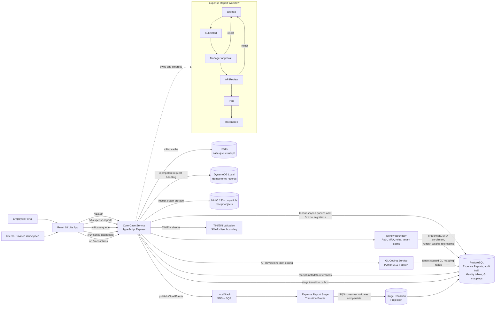

```mermaid
flowchart LR
    employee[Employee Portal]
    internal[Internal Finance Workspace]
    frontend[React 18 Vite App]

    core[Core Case Service<br/>TypeScript Express]
    identity[Identity Boundary<br/>Auth, MFA, roles, tenant claims]
    gl[GL Coding Service<br/>Python 3.13 FastAPI]

    postgres[(PostgreSQL<br/>Expense Reports, audit trail,<br/>identity tables, GL mappings)]
    redis[(Redis<br/>case queue rollups)]
    dynamodb[(DynamoDB Local<br/>idempotency records)]
    minio[(MinIO / S3-compatible<br/>receipt objects)]
    localstack[LocalStack<br/>SNS + SQS]

    stageEvents[Expense Report Stage<br/>Transition Events]
    projection[(Stage Transition<br/>Projection)]
    externalTinEin[TIN/EIN Validation<br/>SOAP client boundary]

    employee --> frontend
    internal --> frontend

    frontend -->|/v1/auth| core
    frontend -->|/v1/expense-reports| core
    frontend -->|/v1/case-queue| core
    frontend -->|/v1/finance-dashboard| core
    frontend -->|/v1/transactions| core

    core --> identity
    core -->|tenant-scoped queries and Drizzle migrations| postgres
    identity -->|credentials, MFA enrollment,<br/>refresh tokens, role claims| postgres

    core -->|AP Review line-item coding| gl
    gl -->|tenant-scoped GL mapping reads| postgres

    core -->|rollup cache| redis
    core -->|idempotent request handling| dynamodb
    core -->|receipt metadata references| postgres
    core -->|receipt object storage| minio
    core -->|TIN/EIN checks| externalTinEin

    core -->|stage transition outbox| postgres
    core -->|publish CloudEvents| localstack
    localstack --> stageEvents
    stageEvents -->|SQS consumer validates and persists| projection
    projection --> postgres

    subgraph workflow[Expense Report Workflow]
        drafted[Drafted]
        submitted[Submitted]
        manager[Manager Approval]
        ap[AP Review]
        paid[Paid]
        reconciled[Reconciled]

        drafted --> submitted --> manager --> ap --> paid --> reconciled
        manager -->|reject| drafted
        ap -->|reject| drafted
    end

    core -. owns and enforces .-> workflow
```